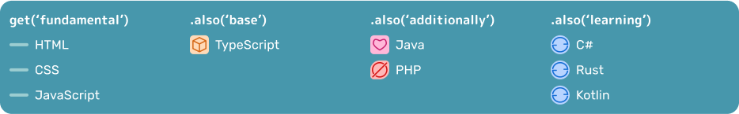
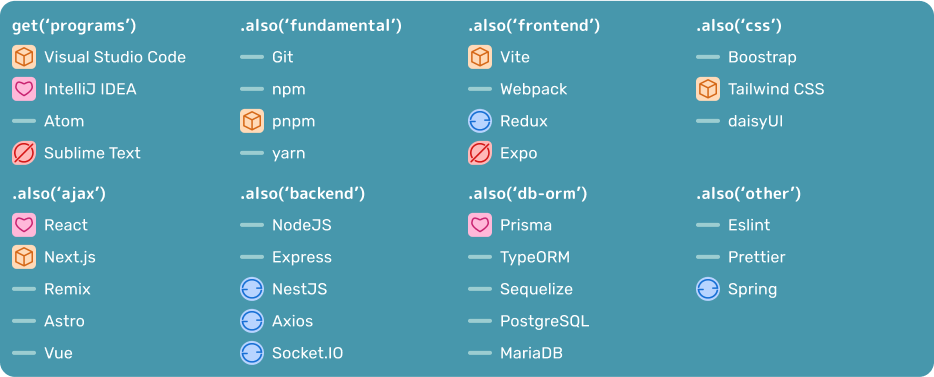
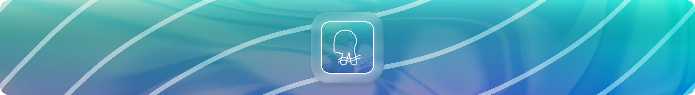

# Valentin Bird

English | _[Русский](README_ru.md)_

## About me

Hi! I've been interested in programming since I was 11 years old, at 13 I started learning my first language – PHP, and at the moment I've been doing web development for about 3-4 years.

For me, programming is not just another hobby, like website design or writing, but one of my favorite activities, more precisely web development, with which I would like to connect my future life.

## Stack

Stack – a set of technologies and principles used in the company's products.

### Languages

### Technologies

## My socials

