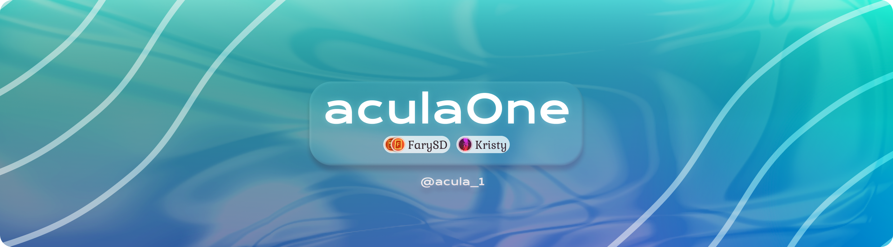
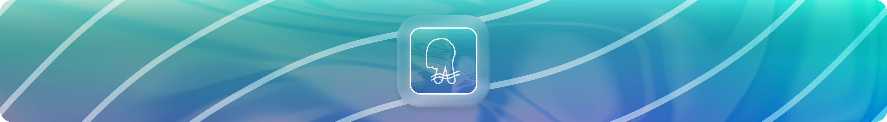

# aculaOne

_[English](README.md)_ | Русский

## Обо мне

Привет! Я интересовался программированием с 11 лет, в 13 начал изучать свой первый язык – PHP, а в данный момент занимаюсь веб-разработкой около трёх лет.

Программирование для меня – не просто очередное хобби, как дизайн сайтов или писательства, а одно из моих любимых занятий, точнее веб-разработка, с которой я бы хотел связать свою дальнейшую жизнь.

## Стек

Стек – совокупность технологий и принципов, применяемых в продуктах.

### Языки

### Технологии

## Мои социалки

